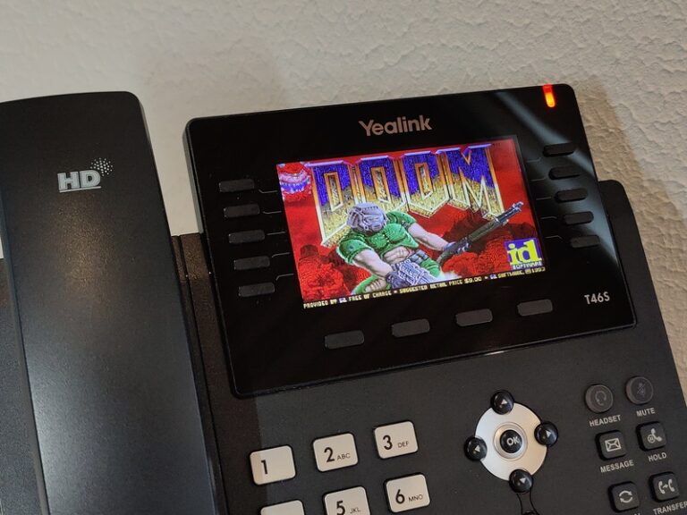
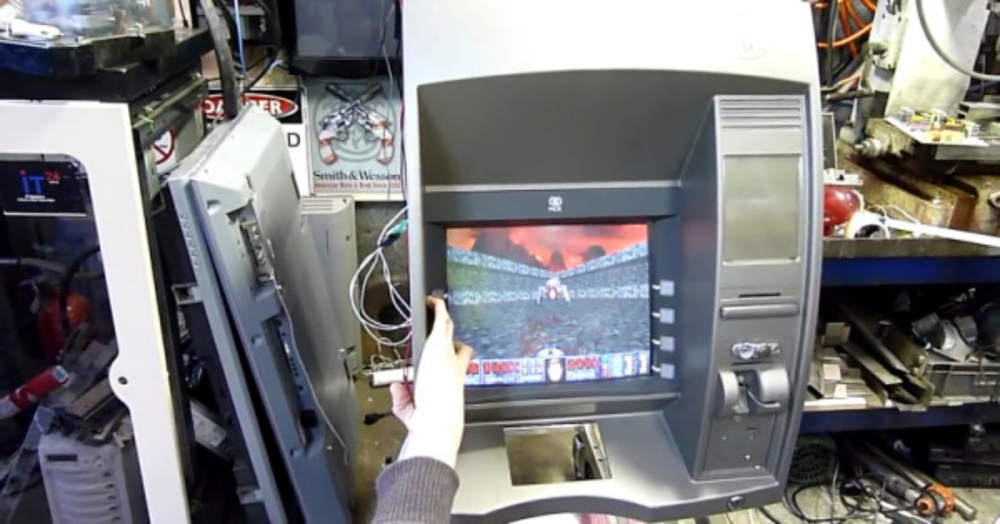
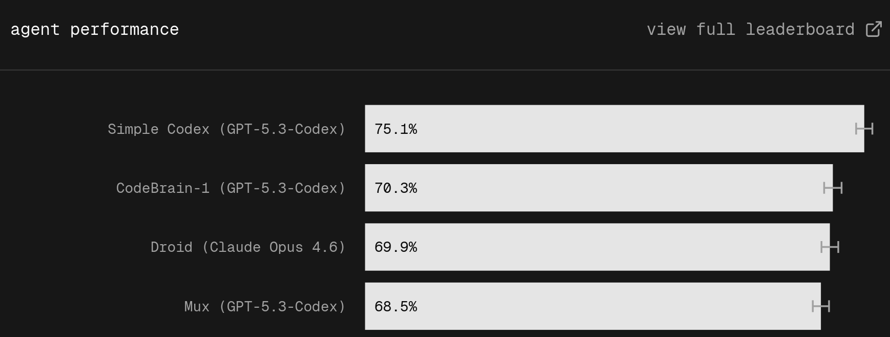
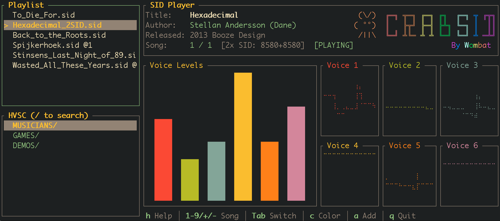
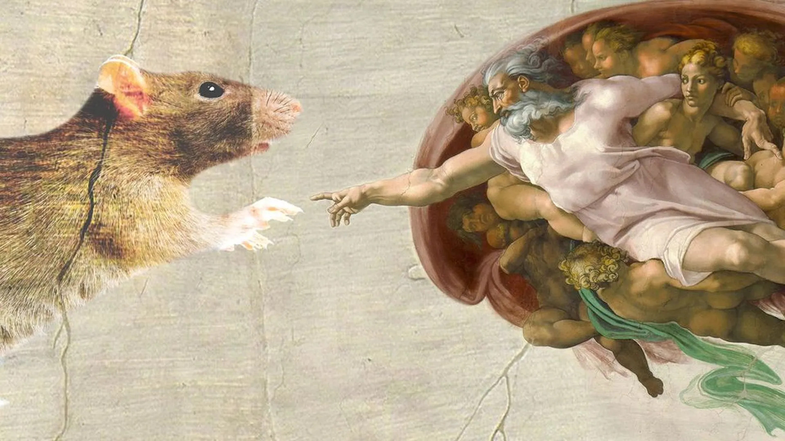

---
theme:
  name: dark
  override:
    footer:
      style: template
      left: "@orhun.dev"
      right: "RustNation UK"
---

---

<!-- alignment: center -->

**If it can compute,  
it can run Ratatui!**

<!-- end_slide -->

<!-- column_layout: [1, 1] -->

<!-- column: 0 -->

<!-- column: 1 -->

<!-- new_lines: 3 -->

## **Orhun Parmaksız**

🦀 Open source Rust developer

🇹🇷 Based in **Ankara, Türkiye**

🐭 Terminal Chef @ Ratatui

📦 Packager @ Arch Linux (btw)

---

https://github.com/orhun  
https://youtube.com/@orhundev

<!-- no_footer -->
<!-- end_slide -->

## The decade old question:

<!-- pause -->

<!-- alignment: center -->

But can it run DOOM?

<!-- no_footer -->

<!-- end_slide -->

<!-- new_lines: 4 -->

<!-- alignment: center -->

But can it run DOOM?

<!-- no_footer -->
<!-- end_slide -->

<!-- new_lines: 4 -->

<!-- alignment: center -->

But can it run DOOM?

<!-- no_footer -->
<!-- end_slide -->

## Today we will answer a similar question.

<!-- pause -->

<!-- new_lines: 3 -->

<!-- alignment: center -->

But can it run Ratatui?

<!-- pause -->

But before, let's talk about terminals.

<!-- no_footer -->

<!-- end_slide -->

## Terminals

Before modern computing, we had simple **terminals**.

<!-- alignment: center -->

<!-- pause -->

And we learned to do a lot with very little.

<!-- no_footer -->

<!-- end_slide -->

# But then...

<!-- alignment: center -->

<!-- pause -->

They changed.
Like everything else.
They evolved.

<!-- no_footer -->

<!-- end_slide -->

## Why terminals in 2026?

They are **timeless**, and still relevant.

Building high quality and modern terminal applications is still a problem.

<!-- pause -->

> And it's a new kind of problem.

<!-- no_footer -->

<!-- end_slide -->

<!-- new_lines: 1 -->

<!-- pause -->

<!-- alignment: center -->

It isn't just about Codex.

There is a pattern.

_A lot of modern terminal software  
is built with **Rust** and **Ratatui**._

<!-- no_footer -->

<!-- end_slide -->

<!-- new_lines: 1 -->

<!-- alignment: center -->

<!-- new_lines: 1 -->

_"I think ratatui makes it really easy to make TUI apps  
compared to older frameworks like ncurses.  
Rust is also trendy right now and for good reason"_

<!-- no_footer -->

<!-- end_slide -->

<!-- alignment: center -->

Ratatui is a Rust library for cooking up terminal user interfaces (TUIs).

- Been around since 2023 (fork of tui-rs)

- 250+ contributors, hundreds of apps, 15M+ crate downloads

- gitui, atuin, yazi, skim, dioxus-cli, tokio-console & more!

- Used by Netflix, AWS, Oxide & more!

https://ratatui.rs

<!-- pause -->

## Let's take a look at some apps! >

<!-- no_footer -->

<!-- end_slide -->

## https://github.com/Harry-kp/vortix

<!-- alignment: center -->

TUI for WireGuard and OpenVPN with real-time telemetry and leak guarding.

<!-- no_footer -->
<!-- end_slide -->

## https://github.com/mlund/crabsid

<!-- alignment: center -->

Commodore 64 SID player. Emulates MOS 6502 and MOS 6581/8580 chips.

<!-- no_footer -->
<!-- end_slide -->

## https://github.com/rogercoll/eprofiler-tui

<!-- speaker_note: receives profiling data via an OTLP gRPC endpoint -->

<!-- alignment: center -->

eBPF profiler flamegraph based TUI

<!-- no_footer -->
<!-- end_slide -->

# Terminal renaissance!

<!-- alignment: center -->

<!-- no_footer -->
<!-- end_slide -->

## But can it run Ratatui?

<!-- alignment: center -->

<!-- pause -->

Ratatui is originally designed for terminals,  
but it can run _anywhere_\*.

<!-- pause -->

\*: with the proper driver and Rust target.

<!-- pause -->

The slides were running in the terminal so far.

<!-- pause -->

Let's switch to another platform.

<!-- pause -->

<!-- no_footer -->
